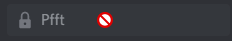
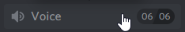
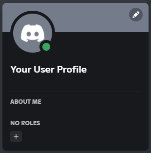
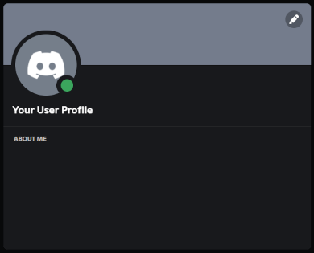
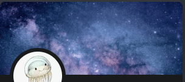
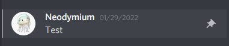

# CSS Snippets
## [ChannelHoverImprovements](https://github.com/Neodymium7/BetterDiscordStuff/blob/main/CSS-Snippets/ChannelHoverImprovements.css)
Alters the hover effects of hidden, locked, and full channels.

 

## [HideOwnNoteSection](https://github.com/Neodymium7/BetterDiscordStuff/blob/main/CSS-Snippets/HideOwnNoteSection.css)
Hides your own note section in the user popout and modal.

 

## [UserBackgroundsImprovements](https://github.com/Neodymium7/BetterDiscordStuff/blob/main/CSS-Snippets/UserBackgroundsImprovements.css)
Adds hover effects to badges from the UserBackgrounds plugin, and makes them look more like the native badges.

  
***(Get UserBackgrounds plugin [here](https://github.com/Strencher/BetterDiscordStuff/blob/master/UserBackgrounds))***

## [PinnedMessageBackgrounds](https://github.com/Neodymium7/BetterDiscordStuff/blob/main/CSS-Snippets/PinnedMessageBackgrounds.css)
Adds a highlight to pinned messages similar to mentions.

  
***(Requires [PinnnedMessageIcons](https://github.com/Neodymium7/BetterDiscordStuff/tree/main/PinnedMessageIcons) plugin)***

## [AddServerDarkMode](https://github.com/Neodymium7/BetterDiscordStuff/blob/main/CSS-Snippets/AddServerDarkMode.css)
Adds a dark theme to the add/join server server modal.

  
***(Note: Messes up colors on light theme)***